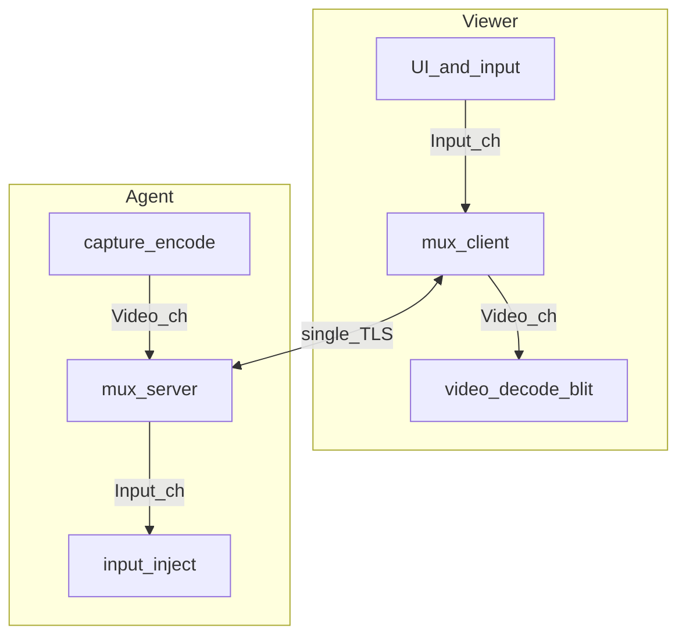
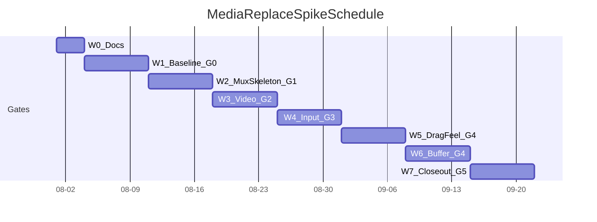

# 媒体面换芯探针：实施计划与进度表

Status: **planned**（分支 `cursor/media-replace-spike`；代码未开）  
Related: [ADR-0004](./adr/0004-compliant-media-self-developed.md), [ADR-0001](./adr/0001-media-plane-vnc-adapter.md), [ADR-0002](./adr/0002-mvp-gpl-then-compliant-media-base.md), [tech-stack.md](./tech-stack.md), [避坑清单](./spike-media-replace-pitfalls.md), [前序探针结论](../spikes/media-plane/RESULTS.md), [本探针结论壳](../spikes/media-replace/RESULTS.md)

**避坑**：实施与每周检查对照 [spike-media-replace-pitfalls.md](./spike-media-replace-pitfalls.md)（含网络：Nagle、mux 饿死、半开连接、长度帧等）。

前序探针（`docs/spike-media-plane.md`）已结案：**继续 A**——MVP 用 LibVNC，交付前换合规实现。本文件是 **合规换芯** 的可执行计划：阶段门禁、周进度、验收与明确不做项。

## 1. 目的（必须回答的问题）

用有时限、默认可扔的探针，回答：

1. 在保住 `media_plane.h` / Schannel / PSK / 互斥 / `win_input` 的前提下，自研非 RFB 媒体面能否在 Win7 Host 上跑通看屏+键鼠？
2. **拖窗手感**能否相对现 LibVNC MVP 路径达到 **档 B**（同机可感知更跟手）？
3. 若达不到档 B：是 GDI+管线上限，还是实现缺陷？产品可接受哪一档？**不自动**开 Mirror 采购或自研驱动立项。

本探针**不替代**仍在进行的 MVP 控制面真机验收；**不重做**历史上已失败的「全量自研 + 视频区优先」。

## 2. 已拍板约束（实施不得再议）

| 项 | 决定 |
|----|------|
| 第三方 VNC Viewer | **不兼容** |
| 语言 | **继续 C/C++（MSVC）**；不用 Go/Rust 做媒体面 |
| 传输 | 单 TLS + 逻辑 mux；P0 不上多 TCP |
| 采集 | **仅 GDI**；不买商业 Mirror；自研 Mirror 靠后 |
| 编码 P0 | zlib 和/或 raw 脏矩形；**禁止**一上来整屏 JPEG |
| 手感 | 冲档 B；不承诺档 C（ToDesk/向日葵） |
| 文件 / 剪贴板 / 登录前 | 探针 P0 **不做**（mux 可留 channel id） |
| 主线 LibVNC | 对照基线保留到切换门禁通过；**G5 未通过前禁止覆盖/删除** `src/media/libvnc_*` 与 LibVNC 链接 |
| LibVNC 备份 | 已验证点：`backup/libvnc-mvp-verified` + tag `libvnc-mvp-verified-2026-08-01`（= `cursor/control-plane-psk-tls` @ `6f650d5`）。换芯只在 `spikes/media-replace/` 与本分支文档演进 |
| DPI / 缩放 | 协议坐标 = Host **帧缓冲像素**；Viewer **不得**故意 DPI-unaware；Win8+ 按 [避坑 §L](./spike-media-replace-pitfalls.md)（system DPI aware + 125%/150% 必测）；P0 不上 Per-Monitor V2 |

### 体验档位

| 档 | 含义 | 承诺 |
|----|------|------|
| A | 合规可交付：无 GPL；控制面 API 仍在 | 必须 |
| B | 同机相对现 LibVNC 拖窗可感知更跟手 | 探针必须冲 |
| C | 接近消费级远控 | 近中期不做 |

### 现状归因（优化对准点）

GDI 整桌采帧 → 脏块 → LibVNC → TLS → Viewer 整帧绘制。拖窗时大脏区 + 发送积压 + 整帧 blit 叠加。换掉 LibVNC **不会自动**达到 ToDesk；近中期用 **mux 优先级 + 最新帧优先 + 脏区合并 + Viewer 局部更新** 冲档 B。

## 3. 架构要点（实现时遵守）

### 3.1 边界

- **留下**：[`src/media/media_plane.h`](../src/media/media_plane.h)、[`tls_schannel.*`](../src/media/tls_schannel.cpp)、[`win_input.*`](../src/media/win_input.cpp)、session PSK / `SessionMutex`、Agent/Viewer 薄壳接线方式。
- **拆掉（仅 G5「切入主线」且产品确认后）**：`libvnc_host.cpp` / `libvnc_client.cpp` 及 third_party LibVNC 链接。在此之前 **不得** 用换芯实现覆盖这些文件。
- **探针期**：实现只放在 `spikes/media-replace/`，可复制/薄包装 TLS 与 input；**不改**主线 LibVNC 适配器源文件（文档与 RESULTS 除外）。
- **回滚**：需要已验证 LibVNC 树时 → `git checkout backup/libvnc-mvp-verified` 或 `git checkout libvnc-mvp-verified-2026-08-01`。

### 3.2 逻辑通道（单 TLS mux）

| channel_id | 内容 | 优先级 | 背压 |
|------------|------|--------|------|
| Control | 鉴权结果、桌面尺寸、拒绝原因、心跳 | 高 | 短消息，不可被 Video 堵死 |
| Input | 指针、键盘 | 高 | 不被 Video 发送堵住 |
| Video | 脏矩形帧（最新优先） | 低～中 | 可丢旧帧 |
| File | （后期） | 低 | 独立流控 |
| Clipboard | （后期） | 中 | 限长 |

帧形（P0 约定，可在 RESULTS 修订小字段）：

```text
u8  channel_id
u32 payload_len   // 小端
bytes payload
```

Video payload（P0 草图）：`frame_id`、矩形数、每矩形 `x,y,w,h` + 编码类型 + 像素/压缩字节。  
发送调度：**Control/Input → Video → File**。进程内：采集/编码、mux 写、注入 **分队列**。



### 3.3 拖窗相关实现清单（按优先级）

1. 采发解耦，**最新帧优先**（发送积压时丢中间帧）。
2. 拖窗脏区 **合并**，避免小块风暴。
3. Viewer：**脏矩形局部更新** + 评估双缓冲（防花屏）；对照基线曾因局部 blit 花屏回退整帧——探针须记录策略与结果。
4. 编码：P0 zlib/raw；带宽不够再开 P1，仍禁止整屏 JPEG 当默认。
5. Input 队列与 Video 发送隔离，保证键鼠不被大帧堵住。

## 4. 稳步原则（推荐，故意偏保守）

1. **先基线后换芯**：没有 Win7 上 LibVNC 正式路径的验收记录 + 拖窗基线笔记，不开换芯代码（避免「说不清有没有变好」）。
2. **先通后快**：先 mux+裸帧/raw 跑通 GUI，再上脏区合并与局部 blit；禁止并行开三条编码实验。
3. **门禁串行**：下表 Gate 未过，不进入下一阶段；允许阶段内小步提交，不允许跳 Gate 并主线。
4. **双路径对照**：探针 exe 与现 `host-agent`/`viewer`（LibVNC）同机同场景对比；不引入 TightVNC 第三方当换芯对照（第三方兼容已放弃）。
5. **Win7 真环为准**：Win11 快环只冒烟；拖窗档 B 结论必须来自 Win7 Host（或与车道同等机电机）。
6. **失败写结论，不硬开驱动**：档 B 未达 → RESULTS 写明上限与产品建议；**不**自动采购 Mirror / 自研驱动。
7. **人周预期**：对齐前序 P5「保持 API 替换实现 3–8 人周」；本表按 **单人 vibe coding + 维护者验收** 折成约 **6～8 个自然周**（含基线周与缓冲）。无交付赶工时宁慢勿跳门禁。

## 5. 阶段划分与交付物

### 阶段 0 — 文档与分支（本阶段）

| 项 | 内容 |
|----|------|
| 分支 | `cursor/media-replace-spike`（已建） |
| 文档 | ADR-0004、本文、`spikes/media-replace/RESULTS.md` 壳、交叉链接 |
| 出门 | 仓库内可按本文执行；无需代码 |

### 阶段 1 — MVP 基线冻结（换芯前置门禁）

| 项 | 内容 |
|----|------|
| 做什么 | Win7：PSK / 互斥 / TLS / 指纹正式路径验收；≥30 分钟浸泡；**专门记录拖窗卡顿场景**（分辨率、是否开「拖动显示内容」、车道 UI 有否视频区、主观卡顿等级 1–5） |
| 记哪里 | [`spikes/media-plane/RESULTS.md`](../spikes/media-plane/RESULTS.md) 补浸泡；拖窗基线可同步抄一节到本探针 RESULTS「对照基线」 |
| 出门 Gate **G0** | 正式路径可连；浸泡无黑屏/闪屏/异常掉线；拖窗基线笔记可复现 |

### 阶段 2 — 探针骨架（mux + TLS + Control）

| 项 | 内容 |
|----|------|
| 目录 | `spikes/media-replace/`：`spike_host` / `spike_viewer`、CMake/脚本、复用或薄封装 Schannel |
| 做什么 | TCP+TLS；Control：口令校验钩子（可先复用 PSK 语义）、桌面尺寸通告、拒绝第二会话（或明确单连接） |
| 不做 | 完整 Video/Input、文件、漂亮 UI |
| 出门 Gate **G1** | Win7 上 TLS 握手 + Control 通；错误路径有日志 |

### 阶段 3 — Video 最小闭环（GDI + raw/zlib）

| 项 | 内容 |
|----|------|
| 做什么 | Host GDI 采主屏；按矩形发 Video；Viewer 能显示；允许先整帧 raw 打通 |
| 风险 | 带宽炸、卡顿——本阶段只要求「能看见、能认 GUI」，不评档 B |
| 出门 Gate **G2** | 内网直连看清桌面；连续操作菜单级 GUI 不花屏崩溃 |

### 阶段 4 — Input 闭环 + 优先级

| 项 | 内容 |
|----|------|
| 做什么 | Viewer 指针/键盘 → Input 通道 → Host `SendInput`；Video 大包发送时 Input 仍可注入；失焦/断连松修饰键（对齐现行为） |
| 出门 Gate **G3** | 同阶段 1 业务 GUI 操作可完成；人为制造 Video 积压时键鼠不明显饿死；**Viewer 125%/150% 缩放点击四角/中心准确**（见避坑 §L） |

### 阶段 5 — 拖窗冲档 B（管线优化）

| 项 | 内容 |
|----|------|
| 做什么 | 最新帧优先、脏区合并、Viewer 局部 blit（+必要双缓冲）、编码调参；**禁止**引入 Mirror |
| 对照 | 同机同场景 vs LibVNC MVP；填 RESULTS 拖窗表（场景、卡顿等级、是否改善） |
| 出门 Gate **G4** | 维护者主观：**可感知优于**基线（档 B）；或书面判定「未达 B，接受 GDI 上限」 |

### 阶段 6 — 收口与切入主线评估

| 项 | 内容 |
|----|------|
| 做什么 | 写满 RESULTS 总判；估切入 `src/media/` 人天；列出主线切换步骤（CMake 去 LibVNC、双路径开关是否保留一期） |
| 出门 Gate **G5** | 总判三选一见 §7；若「切入主线」则另开实现任务（可同分支续做或新 PR） |

**阶段 6 之后（非本探针时间盒内，但进度表列出以免遗忘）**

| 后续 | 触发 |
|------|------|
| 主线切换：探针实现迁入 `src/media/`，正式构建去 GPL | G4 达档 B 或产品书面接受当前档 |
| File 通道 | 产品排期；走自有 channel，不绑 RFB |
| 登录前 | 单列里程碑 |
| 自研 Mirror / 档 C | **仅当**产品明确要求且 G4 结论为 GDI 上限不可接受 |

## 6. 进度表（推荐日历）

锚定：**2026-08-01** 起；单人主实现 + 维护者做 Win7 门禁。日期为 **建议窗口**，以 Gate 为准可整体平移，**不要压缩 Gate**。

| 周次 | 日期（建议） | 阶段 | 主要工作 | 出门 Gate |
|------|--------------|------|----------|-----------|
| W0 | 08-01 ～ 08-03 | 0 | 文档落仓、分支就绪、对照清单打勾 | 文档可执行 |
| W1 | 08-04 ～ 08-10 | 1 | Win7 正式路径验收；≥30min 浸泡；拖窗基线笔记（至少 3 个场景） | **G0** |
| W2 | 08-11 ～ 08-17 | 2 | `spikes/media-replace` 骨架；TLS+Control；构建脚本 | **G1** |
| W3 | 08-18 ～ 08-24 | 3 | GDI → Video 显示闭环（raw/zlib）；Win11 冒烟 + Win7 看屏 | **G2** |
| W4 | 08-25 ～ 08-31 | 4 | Input 通道 + 优先级；修饰键；业务 GUI 走通 | **G3** |
| W5 | 09-01 ～ 09-07 | 5 | 最新帧/脏区合并/局部 blit；同机对照填表 | **G4**（目标） |
| W6 | 09-08 ～ 09-14 | 5 缓冲 | G4 未稳则只做管线，不开新特性；补 Win7 回归 | **G4** |
| W7 | 09-15 ～ 09-21 | 6 | RESULTS 总判；切入主线估时；开切换任务或结案 | **G5** |



### 进度检查点（每周五或 Gate 日）

每次只回答四句，写入 RESULTS「进度日志」：

1. 本周目标 Gate 是否达成？
2. Win7 上最新可复现步骤是什么？
3. 相对基线拖窗主观分（1–5，5 最好）？
4. 下周是否允许进入下一阶段？（是/否 + 阻塞原因）

并过一遍 [避坑清单 §J](./spike-media-replace-pitfalls.md) 出门抽查（尤其 E1 `TCP_NODELAY`、C2 最新帧、C3/E2 Input 优先）。

### 若延期怎么砍（只砍这些）

| 优先保留 | 可延后 |
|----------|--------|
| G0 基线、G1 TLS+Control、G3 键鼠可用 | zlib（可先 raw）、双缓冲精调、好看的 Viewer UI |
| G4 对照结论（哪怕结论是未达 B） | File/Clipboard、多显示器、登录前 |
| 合规路径清晰（无 GPL 进探针包） | 多 TCP、硬件编码、Mirror |

**不砍**：Win7 真环结论、最新帧优先、Input 不被 Video 堵死、门禁记录。

## 7. 验收与总判

### 必过（探针成功切入主线的前提）

- [ ] **合规**：探针产物不链接 LibVNC/GPL 媒体库
- [ ] **功能**：看屏 + 键鼠完成一次业务 GUI 操作（对齐 MVP 验收语义）
- [ ] **TLS**：默认加密；指纹信任路径可用（调试 flag 仅本地）
- [ ] **互斥/鉴权语义**：与控制面一致或明确委托（拒绝第二会话）
- [ ] **档 B**：拖窗相对 LibVNC 基线可感知改善；对照表写入 RESULTS

### 不构成失败

- 未达 ToDesk/向日葵（档 C）
- 桌面内视频区卡顿、粉紫拖影（GDI/overlay 已知）
- 未做文件/剪贴板/登录前

### 总判（到期三选一）

- **切入主线**：档 B 达成（或产品书面接受当前手感）+ 必过项齐全 → 迁 `src/media/`，交付构建去 LibVNC
- **管线再迭代**：架构可用但档 B 未稳 → 延长阶段 5，不改采集战略
- **GDI 上限结案**：确认非实现缺陷 → 产品选择接受档位或 **另立项** 自研 Mirror（仍不默认采购）

## 8. 明确不做（本探针）

- 采购或集成商业 Mirror / 第三方 VNC SDK  
- 自研 Mirror Driver / 登录前远控  
- 兼容 Tight/Ultra/第三方 Viewer  
- 媒体面改 Go/Rust  
- 整屏 JPEG 默认编码、以视频区 FPS 为优化目标  
- 中心目录、审计、中继、浏览器端  
- 把探针构建当正式装站包  
- 跳过 G0 直接写换芯代码  

## 9. 语言选型摘要

| 选项 | 结论 |
|------|------|
| C/C++ | **采用**（与 ADR-0003 / 现 `src/media` 一致） |
| Go 1.20 | 仅 Sidecar；不做媒体面 |
| Rust | 不用 |

## 10. 开源 / 商业 Mirror 摘要

近中期 **不用**。WDK 样例 ≈ 自研起点；VNC 附带 Mirror 多 GPL/商用；MIT 虚拟显示驱动是 Win10+ 假屏，不是 Win7 镜像采集。详见 ADR-0004。

## 11. 与主线关系

| 主线（MVP LibVNC） | 本换芯探针 |
|--------------------|------------|
| 继续真机验收与浸泡 | 消费其基线数据（G0） |
| 代码保留至切换门禁 | 探针代码默认可扔，结论必留 |
| 内部可用 GPL | 探针路径验证无 GPL 交付形态 |
| 控制面已接线 | 换芯不重写 PSK/互斥；复用 TLS 能力 |

冲突时：**以 Win7 真环稳定性与拖窗对照表为准**，更新本文件与 ADR-0004 Consequences，而不是放宽「不黑屏/不闪屏」或假装达到档 C。
