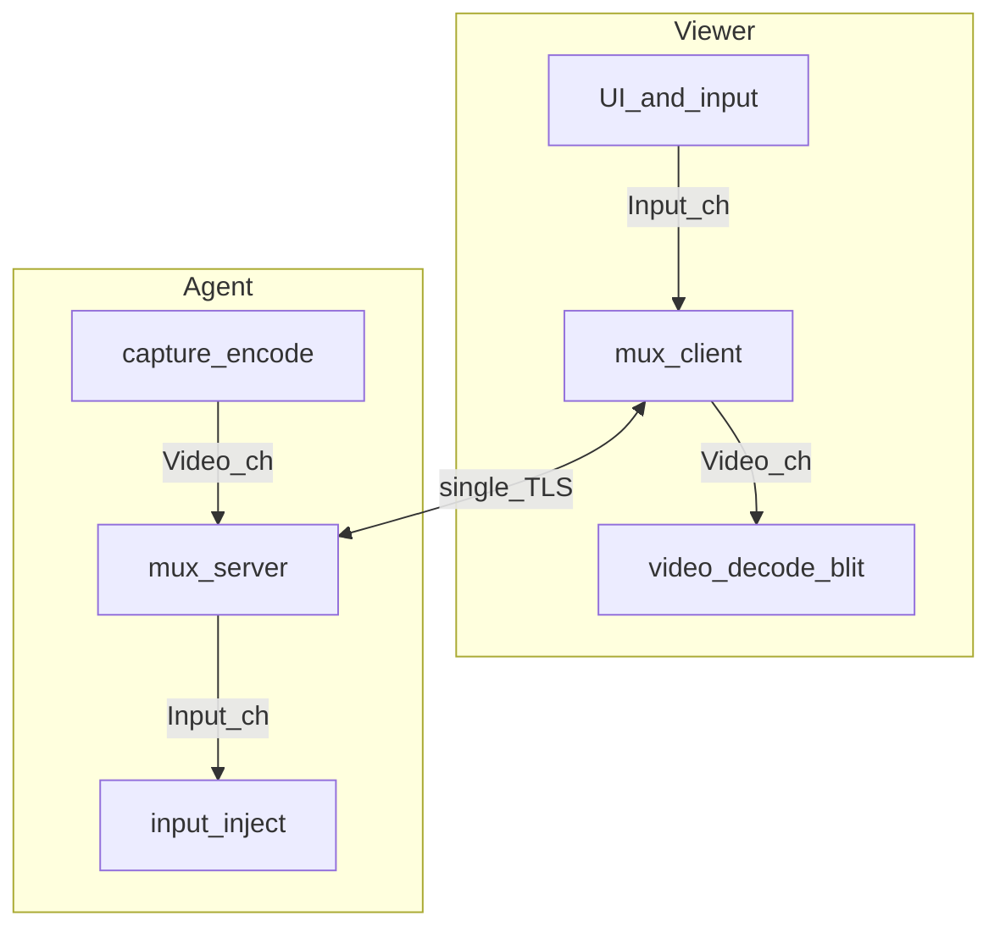
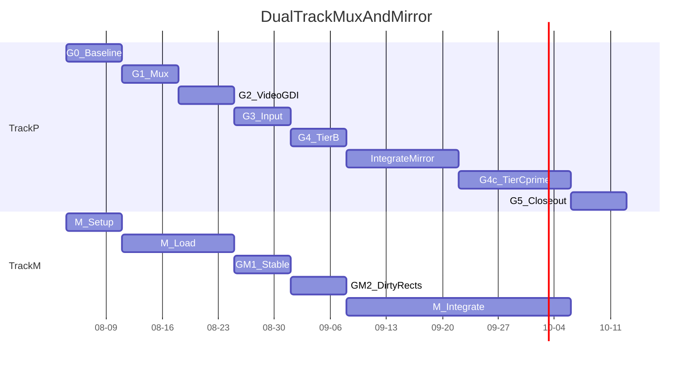

# 媒体面换芯探针：实施计划与进度表

Status: **G5 passed — 主线已切 mux**（分支 `cursor/media-replace-spike`；`src/media` 已接 `mux_host`/`mux_client`，无 LibVNC 链接；结论见 [`spikes/media-replace/RESULTS.md`](../spikes/media-replace/RESULTS.md)；**2026-08-01**）  


Related: [ADR-0004](./adr/0004-compliant-media-self-developed.md), [ADR-0001](./adr/0001-media-plane-vnc-adapter.md), [ADR-0002](./adr/0002-mvp-gpl-then-compliant-media-base.md), [tech-stack.md](./tech-stack.md), [避坑清单](./spike-media-replace-pitfalls.md), [前序探针结论](../spikes/media-plane/RESULTS.md), [本探针结论壳](../spikes/media-replace/RESULTS.md)

**避坑**：实施与每周检查对照 [spike-media-replace-pitfalls.md](./spike-media-replace-pitfalls.md)（含网络：Nagle、mux 饿死、半开连接、长度帧等）。

前序探针（`docs/spike-media-plane.md`）已结案：**继续 A**——MVP 用 LibVNC，交付前换合规实现。本文件是 **合规换芯** 的可执行计划：阶段门禁、周进度、验收与明确不做项。

## 1. 目的（必须回答的问题）

用有时限、默认可扔的探针，回答：

1. 在保住 `media_plane.h` / Schannel / PSK / 互斥 / 注入能力的前提下，自研非 RFB 媒体面能否在 Win7 Host 上跑通看屏+键鼠？
2. **拖窗手感**能否相对现 LibVNC（GDI）达到 **档 B**？
3. 自研 Mirror + mux 后，同机相对 VNC/Radmin（Mirror）能否达到 **档 C′**（不被明显 pass）？
4. 自研 Mirror 失败时：书面结案后再议采购（不默认买）。

本探针**不替代**仍在进行的 MVP 控制面真机验收；**不重做**历史上已失败的「全量自研 + 视频区优先」。

## 2. 已拍板约束（实施不得再议）

| 项 | 决定 |
|----|------|
| 第三方 VNC Viewer | **不兼容** |
| 语言 | **继续 C/C++（MSVC）**；不用 Go/Rust 做媒体面 |
| 传输 | 单 TLS + 逻辑 mux；P0 不上多 TCP |
| 采集 | **自研 Mirror 提前**（交付手感依赖）；GDI 仅 mux 联调/回退；**不买**商业 Mirror SDK |
| 编码 P0 | zlib 和/或 raw 脏矩形；**禁止**一上来整屏 JPEG |
| 手感 | 档 B（优于 LibVNC GDI）为中间门禁；档 **C′**（同机不被 VNC/Radmin+Mirror 明显 pass）为上道目标，绑 Mirror |
| 文件 / 剪贴板 / 登录前 | 探针 P0 **不做**（mux 可留 channel id） |
| 主线 LibVNC | **已切除**：`libvnc_*` / `win_input.*` 已从 `src/media` 删除；构建不链接 LibVNC |
| LibVNC 备份 | `backup/libvnc-mvp-verified` + tag `libvnc-mvp-verified-2026-08-01`（= `6f650d5`）；需要时用 git 回滚，勿再把 GPL 源拉回主线 |
| DPI / 缩放 | 协议坐标 = Host **帧缓冲像素**；Viewer **不得**故意 DPI-unaware；Win8+ 按 [避坑 §L](./spike-media-replace-pitfalls.md)（system DPI aware + 125%/150% 必测）；P0 不上 Per-Monitor V2 |

### 体验档位

| 档 | 含义 | 承诺 |
|----|------|------|
| A | 合规可交付：无 GPL；控制面 API 仍在 | 必须 |
| B | 同机相对现 LibVNC（GDI）拖窗可感知更跟手 | mux 管线中间门禁 |
| C′ | 同机相对现场 VNC/Radmin（用 Mirror）拖窗不被明显 pass | **上道目标；绑自研 Mirror** |
| C | 公网 ToDesk/向日葵全特性 | 仍不做 |

### 现状归因（优化对准点）

GDI 整桌采帧 → 脏块 → LibVNC → TLS → Viewer 整帧绘制。现场竞品走 **Mirror 脏区**，故「只换协议不上 Mirror」会被手感 pass。双轨：**Track P** 私有协议+管线；**Track M** 自研 Mirror 采屏。

## 3. 架构要点（实现时遵守）

### 3.1 边界

- **留下**：[`src/media/media_plane.h`](../src/media/media_plane.h)、[`tls_schannel.*`](../src/media/tls_schannel.cpp)、[`mux_inject.*`](../src/media/mux_inject.cpp)、session PSK / `SessionMutex`、Agent/Viewer 薄壳接线方式。
- **已拆掉**：`libvnc_host.cpp` / `libvnc_client.cpp` / `win_input.*`；主线不链接 third_party LibVNC（`third_party/libvncserver/` 仍 gitignore，仅 media-plane 探针脚本可 fetch）。
- **回滚**：需要已验证 LibVNC 树时 → `git checkout backup/libvnc-mvp-verified` 或 tag `libvnc-mvp-verified-2026-08-01`（整树历史状态，勿只cherry-pick GPL 适配器回主线）。

### 3.2 逻辑通道（单 TLS mux）

| channel_id | 内容 | 优先级 | 背压 |
|------------|------|--------|------|
| Control | 鉴权结果、桌面尺寸、拒绝原因、心跳 | 高 | 短消息，不可被 Video 堵死 |
| Input | 指针、键盘 | 高 | 不被 Video 发送堵住 |
| Video | 脏矩形帧（最新优先） | 低～中 | 可丢旧帧 |
| File | 剪贴板文件分块（`kChannelFile`） | 低 | 独立流控；块间 drain Input |
| Clipboard | 文本 + 位图 + 文件 Offer（`kChannelClipboard`） | 中 | 文本 1 MiB；位图解压 16 MiB；Offer 限长 |

帧形（P0 约定，可在 RESULTS 修订小字段）：

```text
u8  channel_id
u32 payload_len   // 小端
bytes payload
```

Video payload（P0 草图）：`frame_id`、矩形数、每矩形 `x,y,w,h` + 编码类型 + 像素/压缩字节。  
发送调度：**Control/Input → Video → File**。进程内：采集/编码、mux 写、注入 **分队列**。



### 3.3 拖窗相关实现清单（按优先级）

1. 采发解耦，**最新帧优先**（发送积压时丢中间帧）。
2. 拖窗脏区 **合并**，避免小块风暴。
3. Viewer：**脏矩形局部更新** + 评估双缓冲（防花屏）；对照基线曾因局部 blit 花屏回退整帧——探针须记录策略与结果。
4. 编码：P0 zlib/raw；带宽不够再开 P1，仍禁止整屏 JPEG 当默认。
5. Input 队列与 Video 发送隔离，保证键鼠不被大帧堵住。

## 4. 稳步原则（推荐，故意偏保守）

1. **先基线后换芯**：没有 Win7 上 LibVNC 正式路径的验收记录 + 拖窗基线笔记，不开换芯代码（避免「说不清有没有变好」）。
2. **先通后快**：先 mux+裸帧/raw 跑通 GUI，再上脏区合并与局部 blit；禁止并行开三条编码实验。
3. **门禁串行**：下表 Gate 未过，不进入下一阶段；允许阶段内小步提交，不允许跳 Gate 并主线。
4. **双路径对照**：探针 exe 与现 `host-agent`/`viewer`（LibVNC）同机同场景对比；不引入 TightVNC 第三方当换芯对照（第三方兼容已放弃）。
5. **生产环境默认有第三方 Mirror**：无干净「无 Mirror」生产机。档 B 对照 = 同机 Road Desk LibVNC（GDI）；档 C′ 对照 = 同机 VNC/Radmin（其 Mirror）。**Road Desk 交付用手感走自研 Mirror，不调用现场已装的第三方驱动。**
6. **Win7 真环为准**：驱动加载、拖窗 C′ 必须来自 Win7 Host（或同等机电机）。
7. **双轨并行、接口收敛**：Track M（驱动）与 Track P（mux）并行；用户态采屏接口先定「脏矩形回调」，GDI/Mirror 可切换，避免驱动未成就卡死协议。
8. **仍不采购**商业 Mirror SDK；自研失败才书面再议采购，不默认回头买。
9. **人周预期（修订）**：协议换芯约 3–8 人周 + **Mirror 驱动粗估 +4–10 人周**（含签名/共存/蓝屏风险缓冲）；日历约 **10–14 周** 双轨（单人主实现时拉长）。宁慢勿跳驱动门禁。

## 5. 阶段划分与交付物

### 阶段 0 — 文档与分支（本阶段）

| 项 | 内容 |
|----|------|
| 分支 | `cursor/media-replace-spike`（已建） |
| 文档 | ADR-0004、本文、`spikes/media-replace/RESULTS.md` 壳、交叉链接 |
| 出门 | 仓库内可按本文执行；无需代码 |

### 阶段 1 — MVP 基线冻结（换芯前置门禁）

| 项 | 内容 |
|----|------|
| 做什么 | Win7：PSK / 互斥 / TLS / 指纹正式路径验收；≥30 分钟浸泡；**轻量拖窗快照**（见下，不搞完整矩阵） |
| 记哪里 | [`spikes/media-plane/RESULTS.md`](../spikes/media-plane/RESULTS.md) 补浸泡；拖窗快照写入本探针 RESULTS「对照基线」 |
| 出门 Gate **G0** | 正式路径可连；浸泡无黑屏/闪屏/异常掉线；拖窗快照已填（轻量即可） |

**G0 拖窗快照（减负，约 5～10 分钟）**

不要求 ≥3 场景精填、不强制 Radmin/VNC 并排打分。最低只要：

1. **一条**代表性拖窗操作（例如拖资源管理器或业务窗移动数秒）。  
2. 主观一句 + 一档分（1–5，5 最好）：「现 LibVNC / Road Desk」拖窗手感。  
3. **可选**：同机开过 Radmin/VNC 的，用一句话对比即可（例如「明显不如 Radmin」），不必再开一轮并排测。  

详细多场景对照表留到 **G4 / G4c**（那时探针与竞品对比才值得花力气）。

### 阶段 2 — 探针骨架（mux + TLS + Control）

| 项 | 内容 |
|----|------|
| 目录 | `spikes/media-replace/`：`spike_host` / `spike_viewer`、CMake/脚本、复用或薄封装 Schannel |
| 做什么 | TCP+TLS；Control：口令校验钩子（可先复用 PSK 语义）、桌面尺寸通告、拒绝第二会话（或明确单连接） |
| 不做 | 完整 Video/Input、文件、漂亮 UI |
| 出门 Gate **G1** | Win7 上 TLS 握手 + Control 通；错误路径有日志 |

### 阶段 3 — Video 最小闭环（GDI + raw/zlib）

| 项 | 内容 |
|----|------|
| 做什么 | Host GDI 采主屏；按矩形发 Video；Viewer 能显示；允许先整帧 raw 打通 |
| 风险 | 带宽炸、卡顿——本阶段只要求「能看见、能认 GUI」，不评档 B |
| 出门 Gate **G2** | 内网直连看清桌面；连续操作菜单级 GUI 不花屏崩溃 |

### 阶段 4 — Input 闭环 + 优先级

| 项 | 内容 |
|----|------|
| 做什么 | Viewer 指针/键盘 → Input 通道 → Host `SendInput`；Video 大包发送时 Input 仍可注入；失焦/断连松修饰键（对齐现行为） |
| 出门 Gate **G3** | 同阶段 1 业务 GUI 操作可完成；人为制造 Video 积压时键鼠不明显饿死；**Viewer 125%/150% 缩放点击四角/中心准确**（见避坑 §L） |

### 阶段 5 — 拖窗冲档 B（管线优化，仍可 GDI）

| 项 | 内容 |
|----|------|
| 做什么 | 最新帧优先、脏区合并、Viewer 局部 blit（+必要双缓冲）、编码调参 |
| 对照 | 同机 vs LibVNC MVP（GDI） |
| 出门 Gate **G4** | 可感知优于 LibVNC GDI（档 B） |

### 阶段 M — 自研 Mirror（与阶段 2～5 **并行提前**）

| 项 | 内容 |
|----|------|
| 目录 | spikes/mirror-driver/（WDK 样例为起点；**不**把 GPL/商业 VNC Mirror 打进正式包） |
| M0 | WDK、测试签名、Win7 x64 能装能卸 |
| M1 | 用户态拿到脏矩形（或等价）+ 像素；与现场第三方 Mirror **共存策略**写明 |
| M2 | 接到 Track P 采屏接口；冲档 C′ |
| 出门 **GM1** | 测试签名下稳定加载，无必现蓝屏 |
| 出门 **GM2** | 脏区进用户态（小工具可看） |
| 出门 **G4c** | 同机拖窗相对 VNC/Radmin **不被明显 pass** |

### 阶段 6 — 收口与切入主线

| 项 | 内容 |
|----|------|
| 做什么 | RESULTS 总判；切入 src/media/；去 LibVNC；Mirror 部署/签名说明 |
| 出门 **G5** | 档 A + 目标 G4c；Mirror 未达标不得宣称上道手感 |

| 后续 | 触发 |
|------|------|
| File / 登录前 | 产品排期（仍单列） |
| 采购商业 Mirror | **仅**自研书面失败后 |

## 6. 进度表（双轨）

锚定 **2026-08-01**；单人时 P/M **错周**并行。

| 周次 | 日期 | Track P | Track M | 出门 |
|------|------|---------|---------|------|
| W0 | 08-01～03 | 文档修订 | 驱动范围 | 文档 |
| W1 | 08-04～10 | **G0** 浸泡+基线（含 vs Radmin/VNC 参考分） | WDK/测试签 | **G0** |
| W2 | 08-11～17 | **G1** mux | Mirror 加载骨架 | **G1** |
| W3 | 08-18～24 | **G2** GDI Video | 加载稳定 | **G2** |
| W4 | 08-25～31 | **G3** Input+DPI | **GM1** | G3/GM1 |
| W5 | 09-01～07 | **G4** 档 B | **GM2** | G4/GM2 |
| W6–W7 | 09-08～21 | Mirror 接入采屏 | 同左 | 接入 |
| W8–W9 | 09-22～10-05 | **G4c** 档 C′ | 稳定/共存 | **G4c** |
| W10 | 10-06～12 | **G5** 收口 | 部署说明 | **G5** |



### 进度检查点

1. Track P / M 各自 Gate？ 2. Win7 复现？ 3. 拖窗分 vs LibVNC 与 vs Radmin/VNC？ 4. 驱动蓝屏则停 M、P 可续。
避坑 §J + Mirror 签名/共存。

### 若延期怎么砍

| 优先保留 | 可延后 |
|----------|--------|
| G0、G1、G3、GM1/GM2、G4c 结论 | 好看 UI、多 TCP、硬编、File |
| 自研 Mirror 主路径 | 登录前完整验收 |
| 不默认采购 SDK | Per-Monitor V2 |

**不砍**：Win7 真环、Input 优先、驱动可卸。

## 7. 验收与总判

### 必过

- [x] 合规（无 GPL 媒体库进交付意图产物）— 探针产物为自研 mux/TLS
- [x] 看屏+键鼠业务 GUI；TLS；互斥/鉴权 — G1–G3
- [x] **档 B**（vs LibVNC GDI）— G0≈2 → mirror≈4
- [x] **档 C′**（vs 现场 VNC/Radmin+Mirror；上道手感）— vs VNC 通过；Radmin 跳过
- [x] Mirror：可装可卸、测试签路径清晰、共存策略已写 — GM1/GM2/M2 + coexistence.md

### 不构成失败

- 未达公网 ToDesk 全特性（档 C）
- 视频区仍可能卡顿；登录前远控未做（剪贴板/文件已在主线另做）

### 总判

- **切入主线**（**已选并落地，2026-08-01**）：A + B + C′（VNC；Radmin 跳过）→ `src/media` mux + Mirror；LibVNC 源已删
- **管线/驱动再迭代**：架构在，B 或 C′ 未稳 → 延 W8–W9，不采购（历史备选项）
- **自研 Mirror 失败结案**：书面记录后 **才** 议采购商业 Mirror（非默认）

**切入主线必带项：** Mirror 装站见 [`tools/mirror-install/`](../tools/mirror-install/)（单文件 `RoadDeskMirrorSetup.exe`）。Host 提权（任务 3）**已接**：`host-agent` `requireAdministrator` + 非提升拒绝启动。见 RESULTS / [coexistence.md](../spikes/mirror-driver/docs/coexistence.md)。

## 8. 明确不做（本探针）

- 采购/集成商业 Mirror SDK（失败前）
- 调用现场已装的 VNC/Radmin Mirror 当正式依赖
- 兼容第三方 VNC Viewer；媒体面改 Go/Rust
- 整屏 JPEG 默认；中心/审计/中继/浏览器端
- 探针包当正式装站包；跳过 G0

## 9. 语言选型摘要

| 选项 | 结论 |
|------|------|
| C/C++ 用户态 | **采用** |
| Mirror 驱动 | WDK/C（随样例），与 Agent 分树构建 |
| Go / Rust | 不做媒体面 |

## 10. Mirror 摘要

- **自研提前**；WDK mirror 样例作起点。
- 商业 SDK / GPL Mirror：**不**进正式包。
- 现场已装第三方 Mirror：环境事实；正式依赖自有驱动。详见 ADR-0004。

## 11. 与主线关系

| 主线（已切 mux） | 本换芯探针（历史） |
|------------------|--------------------|
| `mux_host` / `mux_client` + Mirror | 提供 G0–G5 对照与结论页 |
| 无 GPL 媒体库进交付产物 | 探针代码可保留，结论必留 |
| 控制面 PSK/互斥/TLS | 换芯未重写；复用 Schannel |

冲突时：**以 Win7 真环稳定性与拖窗对照表为准**，更新本文件与 ADR-0004 Consequences，而不是放宽「不黑屏/不闪屏」或假装达到档 C′。
